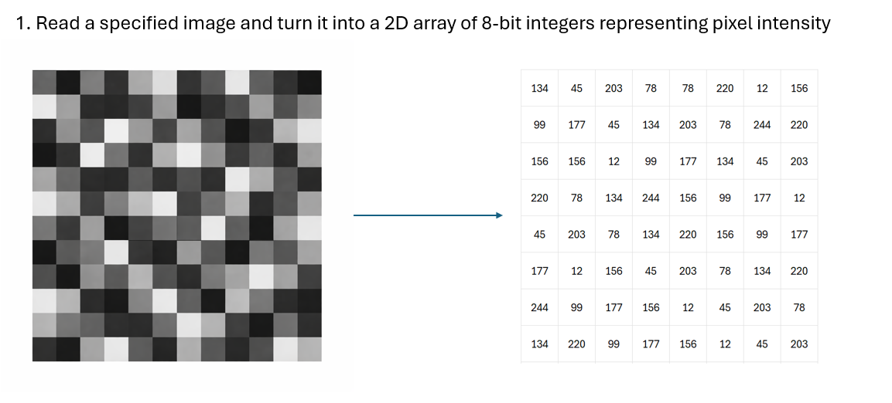
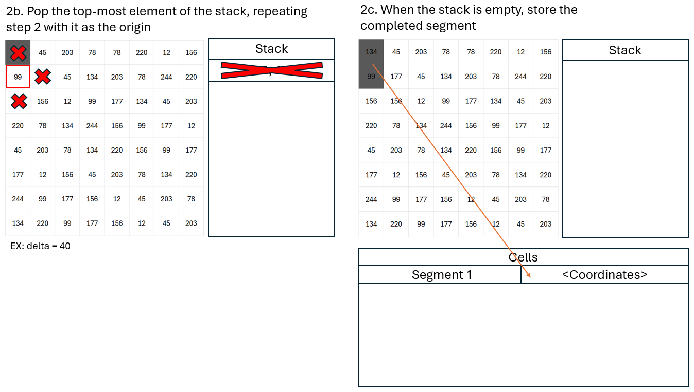
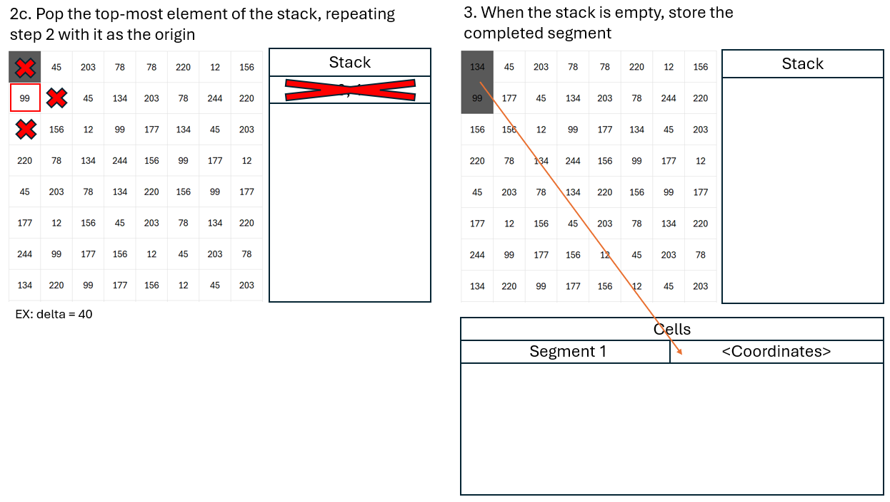
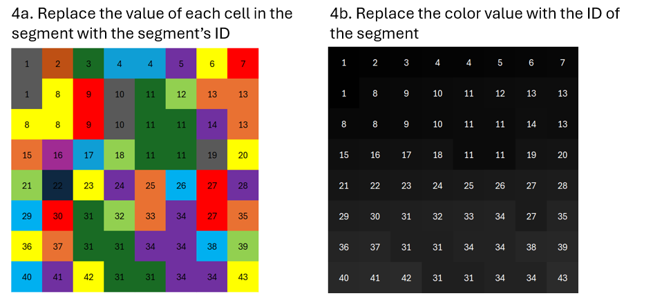
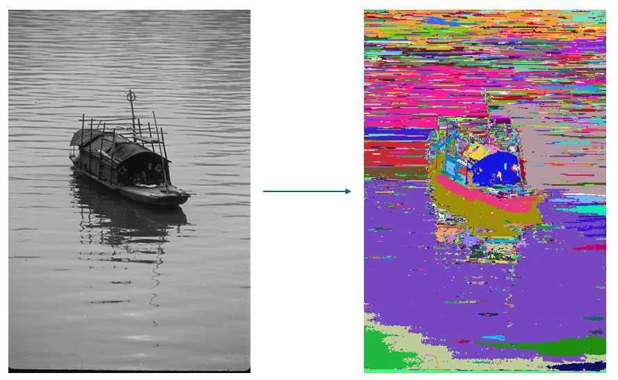
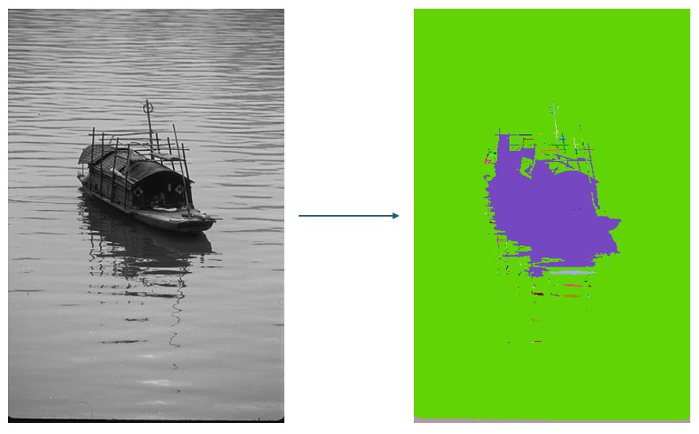
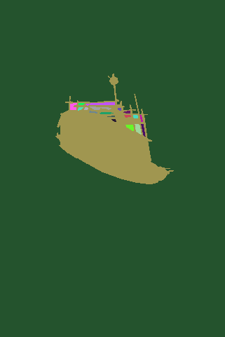

# ACMSE 2026 Undergraduate Programming Contest Submission

Team: Brand Recognition

## Project structure

```
├───src
├───test
│   ├───images
│   └───masks  <-- Output location
└───train
    ├───images
    └───masks
```

## Usage
To build: (project has a precompiled windows binary at `/src/main`)
```
./src/build.sh
```

To run:
```
./src/main <filename> <delta>
```
Output will be located at `/src/output.png`

## Operation





## Examples
Example 1(delta = 15):


Example 2(delta = 100):


Mask from the provided masks (colorized):

